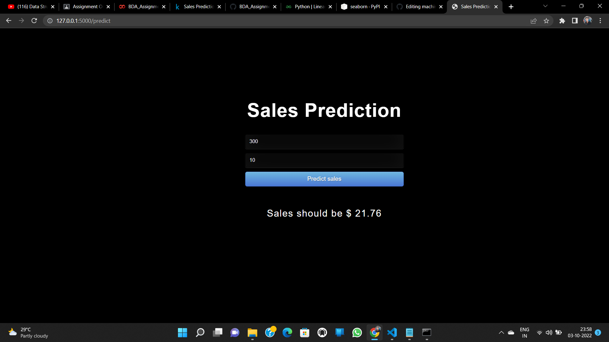

# 1. Predict Sales

## Environment and tools
1. scikit-learn
2. pandas
3. numpy
4. flask
5. seaborn

## Installation 

`pip install scikit-learn pandas numpy flask`

`pip install numpy`

`pip install pandas`

`pip install seaborn`

## steps to run the model in local host

`python model.py`

`python app.py`

